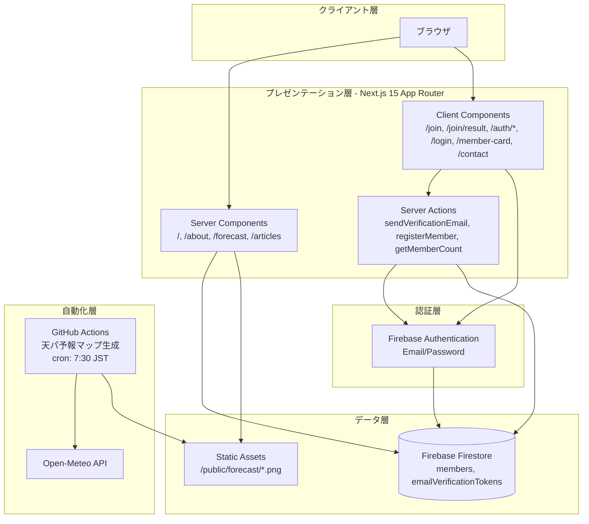
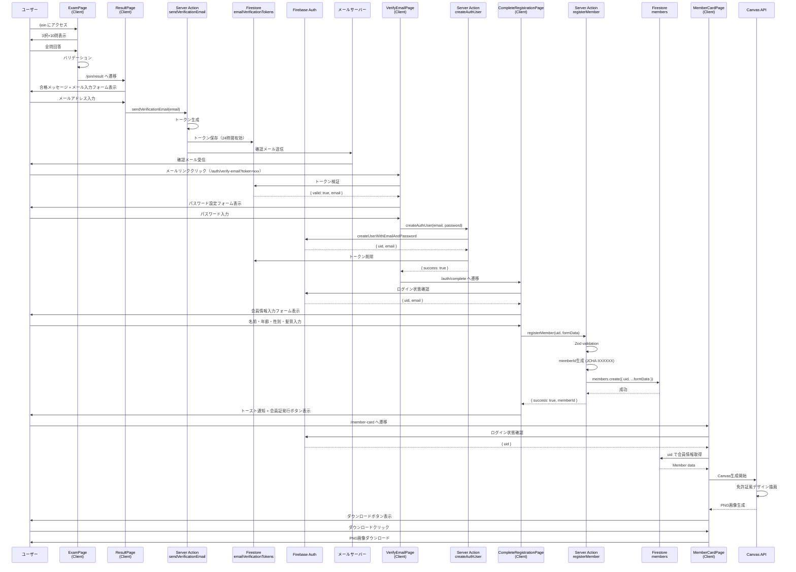
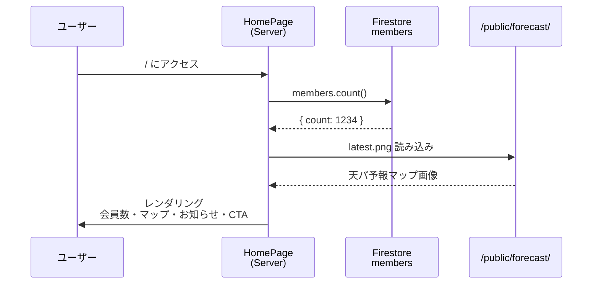
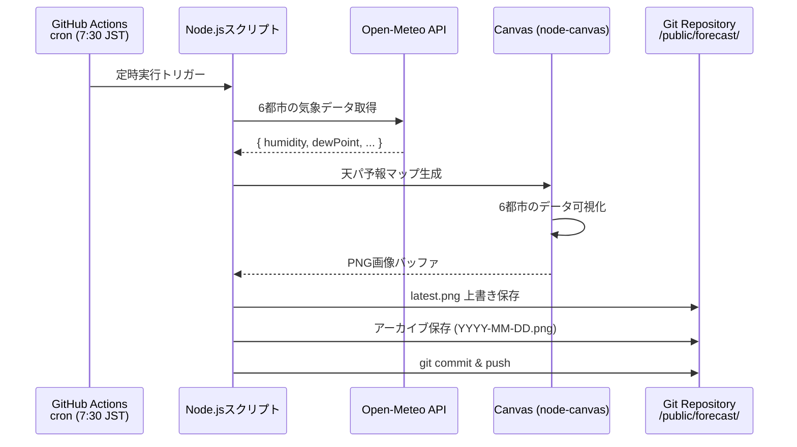
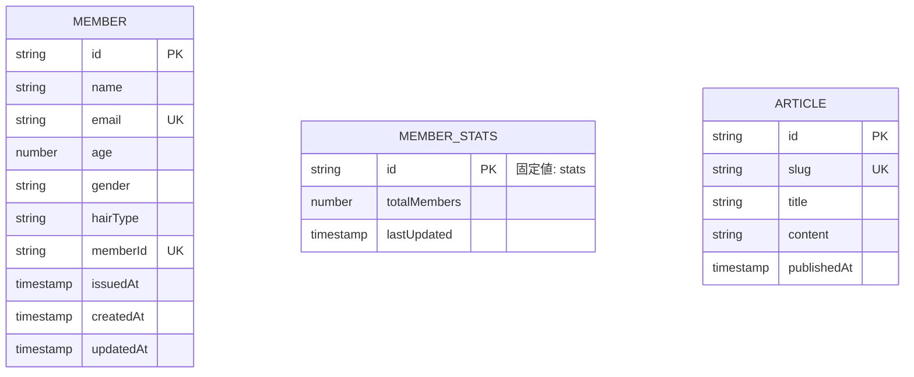
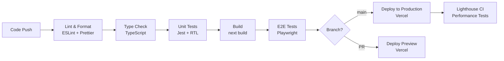

# 技術設計書

## 概要

日本天パ協会Webサイトは、Next.js 15 App RouterとFirebase Firestoreを基盤とした会員管理システムです。真面目な公式団体の外観とネタ要素を組み合わせた体験フローを提供し、入会試験から会員証発行までのシームレスなユーザー体験を実現します。

**主要機能:**
- 入会試験（3択×10問）
- メール確認による本人認証とパスワード設定
- Firebase Authentication による会員管理
- 会員情報登録と免許証風会員証のCanvas生成・PNG出力
- リアルタイム会員数表示
- 天パ予報マップの自動生成・表示
- ネタ記事閲覧とお問い合わせ

## 要件マッピング

### 設計コンポーネントトレーサビリティ

各設計コンポーネントは要件ドキュメントの特定要件に対応しています：

| 設計コンポーネント | 要件参照 | EARS要件 |
|-------------------|---------|---------|
| **HomePage (Server Component)** | 要件1 | WHERE トップページ THE SYSTEM SHALL 会員数と天パ予報マップを表示する |
| **AboutPage (Server Component)** | 要件2 | WHERE 協会についてページ THE SYSTEM SHALL ミッション文・組織体制・倫理規定を表示する |
| **ExamPage (Client Component)** | 要件3 | WHERE 入会試験ページ THE SYSTEM SHALL 3択×10問を表示し、全回答で送信可能にする |
| **EmailRegistrationForm (Client Component)** | 要件4 | WHEN ユーザーが確認メール送信ボタンをクリック THEN システムは確認メールを送信 SHALL する |
| **VerifyEmailPage (Client Component)** | 要件5 | WHERE メール確認ページ THE SYSTEM SHALL パスワード設定フォームを提供し、Firebase Auth でユーザー作成 SHALL する |
| **MemberInfoForm (Client Component)** | 要件6 | WHEN ユーザーが登録ボタンをクリック THEN システムはFirestoreに会員データを作成 SHALL する |
| **LoginPage (Client Component)** | 要件7 | WHERE ログインページ THE SYSTEM SHALL Firebase Authentication でメール・パスワード認証 SHALL する |
| **MemberCardGenerator (Client Component)** | 要件8 | WHERE 会員証ページ THE SYSTEM SHALL ログイン確認後、Canvas生成で免許証風PNG画像を提供する |
| **ForecastPage (Server Component)** | 要件9 | WHERE 予報ページ THE SYSTEM SHALL 最新マップ画像とアーカイブを表示する |
| **ArticlesPage (Server Component)** | 要件10 | WHERE 記事ページ THE SYSTEM SHALL ネタ記事一覧と詳細を表示する |
| **ContactPage (Client Component)** | 要件11 | WHEN ユーザーが送信ボタンをクリック THEN システムは完了メッセージを表示 SHALL する |
| **Firestore Real-time Integration** | 要件12 | WHEN 新規会員登録完了 THEN トップページの会員数は自動的に増加 SHALL する |
| **Firebase Auth & Firestore Security Rules** | 要件13 | WHERE システム THE SYSTEM SHALL Firebase AuthとFirestoreで適切な認証・認可・プライバシー保護を実装する |

### ユーザーストーリーカバレッジ

**要件1-トップページ:** 訪問者として、協会の規模感と最新の天パ予報情報を一目で確認
- **技術実装:** Server Componentで Firestore members.count() + 静的画像表示

**要件3-入会試験:** 入会希望者として、3択×10問の試験を受けて合格
- **技術実装:** Client Componentで useState管理、全回答チェック、useRouterで遷移

**要件4-メールアドレス登録:** 試験合格者として、メールアドレスを登録し、確認メールを受け取る
- **技術実装:** Server Action + Firebase Auth メール送信 + Firestore トークン管理

**要件5-メール確認・パスワード設定:** 確認メールからパスワードを設定し、認証を完了
- **技術実装:** トークン検証 + Firebase Auth ユーザー作成 + パスワード設定フォーム

**要件6-会員情報登録:** 認証完了者として、残りの会員情報を入力して会員登録完了
- **技術実装:** Firebase Auth 状態確認 + Server Action + Zod validation + Firestore書き込み

**要件7-ログイン:** 登録済み会員として、メールアドレスとパスワードでログイン
- **技術実装:** Firebase Auth signInWithEmailAndPassword + リダイレクト

**要件8-会員証発行:** 登録完了者として、免許証風の会員証をPNG画像としてダウンロード
- **技術実装:** ログイン確認 + Canvas API使用、深紺×金配色、会員情報埋め込み

## アーキテクチャ

### システム全体構成



### 技術スタック

| レイヤー | 技術 | バージョン | 選定理由 |
|---------|-----|-----------|---------|
| **フロントエンド** | Next.js | 15.x (App Router) | Server Components対応、SEO最適化、Vercelシームレス統合 |
| **言語** | TypeScript | 5.x | 型安全性、開発効率向上、エラー早期発見 |
| **スタイリング** | TailwindCSS | 3.x | ユーティリティファースト、カスタムカラー簡単設定、官公庁風デザイン実装容易 |
| **データベース** | Firebase Firestore | 9.x | サーバーレス、リアルタイム同期、スケーラビリティ、セキュリティルール |
| **認証** | Firebase Authentication | 9.x | Email/Passwordサインイン、メール確認機能、セキュリティ管理 |
| **画像生成** | Canvas API | - | ブラウザネイティブ、PNG出力、会員証デザイン自由度高 |
| **バリデーション** | Zod | 3.x | 型安全バリデーション、Server Actionsとの統合容易 |
| **フォーム管理** | React Hook Form | 7.x | パフォーマンス最適化、使いやすいAPI、Zodとの統合 |
| **テスト** | Jest + RTL + Playwright | - | ユニット・統合・E2Eテスト包括的カバレッジ |
| **ホスティング** | Vercel | - | Next.js最適化、自動デプロイ、グローバルCDN |
| **CI/CD** | GitHub Actions | - | 自動テスト・デプロイ、天パ予報マップ生成 |

### アーキテクチャ決定理由

**1. Next.js App Router選択理由:**
- **Server Components:** サーバー側レンダリングでSEO最適化、初期ロード高速化
- **ファイルベースルーティング:** 直感的なプロジェクト構造、開発効率向上
- **組み込み最適化:** 画像最適化、フォント最適化、Code Splitting自動
- **Vercel統合:** シームレスなデプロイ、プレビュー環境自動生成

**2. Firebase Firestore選択理由:**
- **サーバーレス:** インフラ管理不要、運用コスト削減
- **リアルタイム同期:** 会員数の即座更新、UX向上
- **スケーラビリティ:** トラフィック増加に自動対応
- **セキュリティルール:** 宣言的アクセス制御、データ保護

**3. TailwindCSS選択理由:**
- **ユーティリティファースト:** 高速開発、CSS記述量削減
- **カスタムカラー:** 深紺#0F172A、金#CDA349の簡単設定
- **デザインシステム:** 官公庁風デザインの一貫性保証

**4. Server Actions選択理由:**
- **型安全通信:** TypeScriptの型情報を活用、ランタイムエラー削減
- **簡潔なAPI:** API Route不要、コード量削減
- **フォーム統合:** React Hook Formとのシームレス連携

## データフロー

### 主要ユーザーフロー

#### 1. 入会フロー（最重要）



#### 2. トップページフロー



#### 3. 天パ予報マップ自動更新フロー



## コンポーネント設計

### フロントエンドコンポーネント階層

```typescript
app/
├── layout.tsx                      // Root Layout (Server Component)
│   ├── Header                     // ナビゲーション・エンブレム
│   ├── Navigation                 // /, /about, /join, /forecast, /articles, /contact
│   └── Footer                     // フッター情報
│
├── page.tsx                       // HomePage (Server Component)
│   ├── HeroSection               // 標語表示
│   ├── MemberCountDisplay        // 会員数リアルタイム表示
│   ├── ForecastMapPreview        // 天パ予報マッププレビュー
│   ├── NewsCards                 // お知らせカード (2-3件)
│   └── CTAButton                 // 入会試験へのCTA
│
├── about/
│   └── page.tsx                  // AboutPage (Server Component)
│       ├── MissionStatement      // ミッション文
│       ├── OrganizationChart     // 組織体制
│       └── EthicsGuidelines      // 倫理規定
│
├── join/
│   ├── page.tsx                  // ExamPage (Client Component)
│   │   ├── QuestionCard         // 3択質問カード (×10)
│   │   ├── AnswerRadioGroup     // 回答ラジオボタン
│   │   └── SubmitButton         // 送信ボタン（全回答チェック）
│   │
│   └── result/
│       └── page.tsx              // ResultPage (Client Component)
│           ├── SuccessMessage    // 合格メッセージ
│           ├── RegistrationForm  // 会員登録フォーム
│           │   ├── NameInput     // 名前（任意）
│           │   ├── EmailInput    // メール（必須）
│           │   ├── AgeInput      // 年齢（必須）
│           │   ├── GenderRadio   // 性別（必須）
│           │   ├── HairTypeRadio // 髪質（必須）
│           │   └── ConsentCheck  // 同意チェック（必須）
│           └── IssueCardButton   // 会員証発行ボタン
│
├── member-card/
│   └── page.tsx                  // MemberCardPage (Client Component)
│       ├── MemberCardCanvas      // Canvas生成コンポーネント
│       └── DownloadButton        // PNGダウンロードボタン
│
├── forecast/
│   └── page.tsx                  // ForecastPage (Server Component)
│       ├── LatestMapDisplay      // 最新マップ表示
│       ├── ArchiveList           // アーカイブリスト (7日分)
│       └── TermsGlossary         // 用語解説
│
├── articles/
│   ├── page.tsx                  // ArticlesListPage (Server Component)
│   │   └── ArticleCard          // 記事カード
│   └── [slug]/
│       └── page.tsx              // ArticleDetailPage (Server Component)
│           └── MarkdownContent   // Markdown表示
│
├── contact/
│   └── page.tsx                  // ContactPage (Client Component)
│       ├── ContactForm           // お問い合わせフォーム
│       └── SubmitButton          // 送信ボタン
│
└── privacy/
    └── page.tsx                  // PrivacyPolicyPage (Server Component)
```

### Server Actions定義

```typescript
// app/actions/members.ts

import { z } from 'zod';
import { db } from '@/lib/firebase';
import { collection, addDoc, getDocs, query, where, Timestamp } from 'firebase/firestore';

// バリデーションスキーマ
const MemberFormSchema = z.object({
  name: z.string().optional().nullable(),
  email: z.string().email('有効なメールアドレスを入力してください'),
  age: z.number().int().min(13, '13歳以上である必要があります').max(120, '120歳以下である必要があります'),
  gender: z.enum(['男性', '女性', 'その他']),
  hairType: z.enum(['直毛', 'くせ毛', 'その他']),
  consentToPrivacyPolicy: z.boolean().refine(val => val === true, '同意が必要です'),
});

type MemberFormData = z.infer<typeof MemberFormSchema>;

interface RegisterMemberResult {
  success: boolean;
  memberId?: string;
  error?: string;
}

/**
 * 会員登録
 *
 * バリデーション、会員番号生成、Firestore保存を実行
 */
export async function registerMember(formData: MemberFormData): Promise<RegisterMemberResult> {
  'use server';

  try {
    // サーバー側バリデーション
    const validated = MemberFormSchema.parse(formData);

    // メール重複チェック
    const emailQuery = query(
      collection(db, 'members'),
      where('email', '==', validated.email)
    );
    const emailSnapshot = await getDocs(emailQuery);

    if (!emailSnapshot.empty) {
      return { success: false, error: 'このメールアドレスは既に登録されています' };
    }

    // 会員番号生成（重複チェック付き）
    let memberId: string;
    let isUnique = false;

    while (!isUnique) {
      memberId = generateMemberId();
      const memberIdQuery = query(
        collection(db, 'members'),
        where('memberId', '==', memberId)
      );
      const memberIdSnapshot = await getDocs(memberIdQuery);
      isUnique = memberIdSnapshot.empty;
    }

    // Firestore保存
    const memberData = {
      name: validated.name || null,
      email: validated.email,
      age: validated.age,
      gender: validated.gender,
      hairType: validated.hairType,
      memberId: memberId!,
      issuedAt: Timestamp.now(),
      createdAt: Timestamp.now(),
      updatedAt: Timestamp.now(),
    };

    await addDoc(collection(db, 'members'), memberData);

    return { success: true, memberId: memberId! };

  } catch (error) {
    console.error('会員登録エラー:', error);
    return { success: false, error: '登録に失敗しました。もう一度お試しください。' };
  }
}

/**
 * 会員番号生成
 *
 * 形式: JCHA-XXXXXX (6桁ランダム数字)
 */
function generateMemberId(): string {
  const randomDigits = Math.floor(Math.random() * 1000000)
    .toString()
    .padStart(6, '0');
  return `JCHA-${randomDigits}`;
}

/**
 * 会員数取得
 */
export async function getMemberCount(): Promise<number> {
  'use server';

  try {
    const membersSnapshot = await getDocs(collection(db, 'members'));
    return membersSnapshot.size;
  } catch (error) {
    console.error('会員数取得エラー:', error);
    return 0;
  }
}

/**
 * 会員情報取得
 */
export async function getMemberById(memberId: string): Promise<Member | null> {
  'use server';

  try {
    const memberQuery = query(
      collection(db, 'members'),
      where('memberId', '==', memberId)
    );
    const memberSnapshot = await getDocs(memberQuery);

    if (memberSnapshot.empty) {
      return null;
    }

    const memberDoc = memberSnapshot.docs[0];
    return { id: memberDoc.id, ...memberDoc.data() } as Member;

  } catch (error) {
    console.error('会員情報取得エラー:', error);
    return null;
  }
}
```

### コンポーネント責務一覧

| コンポーネント | タイプ | 責務 | Props/State |
|--------------|-------|------|------------|
| **HomePage** | Server | 会員数・天パ予報マップ・お知らせ表示 | - |
| **ExamPage** | Client | 10問の3択試験、回答状態管理、送信制御 | answers: string[], isComplete: boolean |
| **RegistrationForm** | Client | フォーム入力・バリデーション・Server Action呼び出し | formData: MemberFormData, errors: FormErrors |
| **MemberCardGenerator** | Client | Canvas生成、会員情報表示、PNG出力 | member: Member, canvasRef: RefObject |
| **ForecastPage** | Server | 天パ予報マップ・アーカイブ・用語解説表示 | - |
| **ArticlesListPage** | Server | 記事一覧表示 | articles: Article[] |
| **ContactPage** | Client | お問い合わせフォーム、擬似完了表示 | formData: ContactFormData |

## データモデル

### ドメインエンティティ

1. **Member（会員）:** 協会会員の基本情報と登録メタデータ
2. **MemberStats（会員統計）:** 会員数集計（将来のパフォーマンス最適化用）
3. **Article（記事）:** ネタ記事コンテンツ（Markdown or CMS）

### エンティティ関係図



### データモデル定義

```typescript
// lib/types/member.ts

import { Timestamp } from 'firebase/firestore';

/**
 * 会員データモデル
 */
export interface Member {
  id: string;                           // Firestore document ID
  name: string | null;                  // 任意（表示名）
  email: string;                        // 必須・ユニーク
  age: number;                          // 13-120
  gender: '男性' | '女性' | 'その他';
  hairType: '直毛' | 'くせ毛' | 'その他';
  memberId: string;                     // JCHA-XXXXXX形式・ユニーク
  issuedAt: Timestamp;                  // 登録日時
  createdAt: Timestamp;                 // ドキュメント作成日時
  updatedAt: Timestamp;                 // 最終更新日時
}

/**
 * 会員統計データモデル（パフォーマンス最適化用）
 */
export interface MemberStats {
  id: 'stats';                          // 固定ID
  totalMembers: number;                 // 会員数集計
  lastUpdated: Timestamp;               // 最終更新
}

/**
 * 記事データモデル
 */
export interface Article {
  id: string;                           // Firestore document ID
  slug: string;                         // URL slug（ユニーク）
  title: string;                        // 記事タイトル
  content: string;                      // Markdown content
  publishedAt: Timestamp;               // 公開日時
}

/**
 * 会員登録フォームデータ
 */
export interface MemberFormData {
  name?: string | null;
  email: string;
  age: number;
  gender: '男性' | '女性' | 'その他';
  hairType: '直毛' | 'くせ毛' | 'その他';
  consentToPrivacyPolicy: boolean;
}
```

### Firestoreスキーマ

```typescript
// Firestore Collections

// members (会員コレクション)
{
  "members": {
    "[documentId]": {
      "name": "田中太郎" | null,
      "email": "tanaka@example.com",
      "age": 28,
      "gender": "男性",
      "hairType": "くせ毛",
      "memberId": "JCHA-123456",
      "issuedAt": Timestamp,
      "createdAt": Timestamp,
      "updatedAt": Timestamp
    }
  }
}

// member_stats (会員統計コレクション - 将来拡張)
{
  "member_stats": {
    "stats": {
      "totalMembers": 1234,
      "lastUpdated": Timestamp
    }
  }
}
```

### インデックス戦略

**必須インデックス:**
1. `email` - ユニーク制約、重複登録防止
2. `memberId` - ユニーク制約、会員証検索用
3. `createdAt` - 降順、会員一覧ソート用

**Firestore複合インデックス:**
```
// firestore.indexes.json
{
  "indexes": [
    {
      "collectionGroup": "members",
      "queryScope": "COLLECTION",
      "fields": [
        { "fieldPath": "createdAt", "order": "DESCENDING" }
      ]
    }
  ]
}
```

### マイグレーション戦略

**初期セットアップ:**
1. Firestoreセキュリティルール適用
2. 必須インデックス作成
3. テストデータ投入（開発環境）

**将来の拡張:**
- MemberStatsコレクション追加（パフォーマンス最適化時）
- Articlesコレクション追加（記事管理CMS統合時）
- 認証機能追加（Firebase Auth統合時）

## エラーハンドリング

### エラー処理戦略

**1. クライアント側エラー:**
- フォームバリデーションエラー: React Hook Form + Zod
- ネットワークエラー: トースト通知 + リトライ機能
- Canvas生成エラー: フォールバック画像表示

**2. サーバー側エラー:**
- Server Actionsエラー: try-catchで捕捉、エラーメッセージ返却
- Firestoreエラー: エラーログ記録、ユーザーフレンドリーメッセージ表示
- 重複登録エラー: 明示的エラーメッセージ

**3. エラーバウンダリー:**
```typescript
// app/error.tsx (Next.js Error Boundary)
'use client';

export default function Error({ error, reset }: {
  error: Error & { digest?: string };
  reset: () => void;
}) {
  return (
    <div className="min-h-screen flex items-center justify-center">
      <div className="text-center">
        <h2 className="text-2xl font-bold mb-4">エラーが発生しました</h2>
        <p className="text-gray-600 mb-4">{error.message}</p>
        <button onClick={reset} className="bg-primary text-white px-4 py-2 rounded">
          再試行
        </button>
      </div>
    </div>
  );
}
```

## セキュリティ考慮事項

### 認証・認可

**現状（初期実装）:**
- 認証なし（匿名会員登録）
- 読み取り: 会員数のみ公開
- 書き込み: 新規登録のみ許可

**将来拡張:**
- Firebase Authentication統合
- 会員ログイン機能
- マイページ機能

### データ保護

**Firestoreセキュリティルール:**

```javascript
// firestore.rules
rules_version = '2';
service cloud.firestore {
  match /databases/{database}/documents {
    // 会員コレクション
    match /members/{memberId} {
      // 会員数カウント用のread権限（全体アクセス許可）
      allow read: if true;

      // 新規会員登録のみ許可
      allow create: if
        // 必須フィールドの存在チェック
        request.resource.data.keys().hasAll([
          'name', 'email', 'age', 'gender', 'hairType', 'memberId', 'issuedAt', 'createdAt', 'updatedAt'
        ])
        // 年齢バリデーション
        && request.resource.data.age is int
        && request.resource.data.age >= 13
        && request.resource.data.age <= 120
        // メール形式バリデーション
        && request.resource.data.email.matches('^[^@]+@[^@]+\\.[^@]+$')
        // gender/hairType enum チェック
        && request.resource.data.gender in ['男性', '女性', 'その他']
        && request.resource.data.hairType in ['直毛', 'くせ毛', 'その他']
        // memberId形式チェック
        && request.resource.data.memberId.matches('^JCHA-[0-9]{6}$');

      // 更新・削除は禁止（データ保護）
      allow update, delete: if false;
    }

    // 会員統計コレクション（将来拡張用）
    match /member_stats/stats {
      // 読み取りのみ許可
      allow read: if true;
      // 書き込みはCloud Functionsのみ
      allow write: if false;
    }
  }
}
```

**入力バリデーション（多層防御）:**

1. **クライアント側:** React Hook Form + Zod（即座フィードバック）
2. **サーバー側:** Server Actionsで再検証（改ざん防止）
3. **Firestore:** セキュリティルールで最終検証（最後の砦）

### セキュリティベストプラクティス

**XSS対策:**
- Reactのデフォルトエスケープ機能活用
- `dangerouslySetInnerHTML`使用禁止
- Content Security Policy (CSP)設定

**CSRF対策:**
- Next.js Server Actionsのビルトイン保護
- SameSite Cookie設定

**データ漏洩防止:**
- 個人情報の最小限取得
- プライバシーポリシー明示
- HTTPS強制（Vercel自動対応）

## パフォーマンス最適化

### パフォーマンス目標

| メトリック | 目標値 | 測定方法 |
|-----------|-------|---------|
| **First Contentful Paint (FCP)** | < 1.5s | Lighthouse |
| **Largest Contentful Paint (LCP)** | < 2.5s | Lighthouse |
| **Time to Interactive (TTI)** | < 3.5s | Lighthouse |
| **Total Blocking Time (TBT)** | < 300ms | Lighthouse |
| **Cumulative Layout Shift (CLS)** | < 0.1 | Lighthouse |
| **API Response Time (p95)** | < 200ms | Firestore Monitoring |
| **API Response Time (p99)** | < 500ms | Firestore Monitoring |

### キャッシング戦略

**1. ブラウザキャッシュ:**
- 静的アセット: Cache-Control max-age=31536000
- 天パ予報マップ: Cache-Control max-age=3600（1時間）

**2. CDN:**
- Vercel Edge Network自動活用
- 画像最適化: Next.js Image component

**3. アプリケーションキャッシュ:**
- Server Components: 自動キャッシュ（Next.js App Router）
- 会員数: React Cache APIまたはISR（60秒revalidate）

**4. データベースキャッシュ:**
- 会員数表示最適化（2段階アプローチ）:
  - **初期実装:** リアルタイム集計 `getDocs(collection(db, 'members')).size`
  - **最適化実装:** MemberStatsコレクション + Cloud Functions

### 会員数表示最適化実装

**オプション1: リアルタイム集計（初期）**
```typescript
export async function getMemberCount(): Promise<number> {
  const membersSnapshot = await getDocs(collection(db, 'members'));
  return membersSnapshot.size;
}
```

**オプション2: 集計ドキュメント（スケーラブル）**
```typescript
// Cloud Function (会員登録時トリガー)
export const updateMemberStats = onDocumentCreated('members/{memberId}', async (event) => {
  const statsRef = doc(db, 'member_stats', 'stats');
  await updateDoc(statsRef, {
    totalMembers: increment(1),
    lastUpdated: Timestamp.now()
  });
});

// Server Action
export async function getMemberCount(): Promise<number> {
  const statsDoc = await getDoc(doc(db, 'member_stats', 'stats'));
  return statsDoc.data()?.totalMembers || 0;
}
```

### スケーラビリティアプローチ

**水平スケーリング:**
- Vercel自動スケーリング
- Firestore自動スケーリング

**画像最適化:**
- Next.js Image component（自動WebP変換）
- 天パ予報マップ: 事前WebP生成検討

**コード分割:**
- Next.js自動Code Splitting
- Dynamic import for大きなコンポーネント

## テスト戦略

### テストカバレッジ要件

| テストタイプ | カバレッジ目標 | ツール |
|------------|-------------|-------|
| **ユニットテスト** | ≥ 80% | Jest + React Testing Library |
| **統合テスト** | 全APIエンドポイント | Jest + MSW |
| **E2Eテスト** | クリティカルフロー | Playwright |
| **パフォーマンステスト** | 2×予想ピーク | Lighthouse CI |

### テストアプローチ

**1. ユニットテスト:**
```typescript
// __tests__/lib/utils/generateMemberId.test.ts
describe('generateMemberId', () => {
  it('JCHA-XXXXXX形式で生成される', () => {
    const memberId = generateMemberId();
    expect(memberId).toMatch(/^JCHA-\d{6}$/);
  });

  it('6桁の数字がゼロパディングされる', () => {
    const memberId = generateMemberId();
    const digits = memberId.split('-')[1];
    expect(digits).toHaveLength(6);
  });
});
```

**2. 統合テスト:**
```typescript
// __tests__/actions/registerMember.test.ts
import { registerMember } from '@/app/actions/members';

describe('registerMember', () => {
  it('有効なデータで会員登録が成功する', async () => {
    const formData = {
      name: 'テスト太郎',
      email: 'test@example.com',
      age: 25,
      gender: '男性' as const,
      hairType: 'くせ毛' as const,
      consentToPrivacyPolicy: true,
    };

    const result = await registerMember(formData);

    expect(result.success).toBe(true);
    expect(result.memberId).toMatch(/^JCHA-\d{6}$/);
  });

  it('無効なメールアドレスでエラーになる', async () => {
    const formData = {
      email: 'invalid-email',
      // ... other fields
    };

    const result = await registerMember(formData);

    expect(result.success).toBe(false);
    expect(result.error).toContain('メールアドレス');
  });
});
```

**3. E2Eテスト:**
```typescript
// e2e/membership-flow.spec.ts
import { test, expect } from '@playwright/test';

test('入会フロー完全テスト', async ({ page }) => {
  // 1. トップページアクセス
  await page.goto('/');
  await expect(page.locator('h1')).toContainText('日本天パ協会');

  // 2. 入会試験開始
  await page.click('text=入会試験へ');
  await expect(page).toHaveURL('/join');

  // 3. 10問回答
  for (let i = 0; i < 10; i++) {
    await page.click(`[data-testid="question-${i}"] input[type="radio"]`);
  }

  // 4. 送信
  await page.click('text=送信');
  await expect(page).toHaveURL('/join/result');
  await expect(page.locator('text=合格')).toBeVisible();

  // 5. 会員登録
  await page.fill('[name="email"]', 'e2e-test@example.com');
  await page.fill('[name="age"]', '25');
  await page.check('[name="gender"][value="男性"]');
  await page.check('[name="hairType"][value="くせ毛"]');
  await page.check('[name="consentToPrivacyPolicy"]');
  await page.click('text=登録する');

  // 6. 会員証発行
  await expect(page.locator('text=会員証を発行する')).toBeVisible();
  await page.click('text=会員証を発行する');
  await expect(page).toHaveURL('/member-card');

  // 7. 会員証ダウンロード
  const downloadPromise = page.waitForEvent('download');
  await page.click('text=ダウンロード');
  const download = await downloadPromise;
  expect(download.suggestedFilename()).toMatch(/member-card-JCHA-\d{6}\.png/);
});
```

**4. パフォーマンステスト:**
```yaml
# .github/workflows/lighthouse-ci.yml
name: Lighthouse CI
on: [push]
jobs:
  lighthouse:
    runs-on: ubuntu-latest
    steps:
      - uses: actions/checkout@v3
      - uses: actions/setup-node@v3
      - run: npm ci
      - run: npm run build
      - name: Run Lighthouse CI
        uses: treosh/lighthouse-ci-action@v9
        with:
          urls: |
            http://localhost:3000
            http://localhost:3000/join
            http://localhost:3000/forecast
          uploadArtifacts: true
```

### CI/CDパイプライン



**GitHub Actions設定:**

```yaml
# .github/workflows/ci.yml
name: CI/CD
on:
  push:
    branches: [main]
  pull_request:
    branches: [main]

jobs:
  test:
    runs-on: ubuntu-latest
    steps:
      - uses: actions/checkout@v3
      - uses: actions/setup-node@v3
        with:
          node-version: '18'
          cache: 'npm'

      - name: Install dependencies
        run: npm ci

      - name: Lint
        run: npm run lint

      - name: Type check
        run: npm run type-check

      - name: Unit tests
        run: npm run test:coverage

      - name: Build
        run: npm run build

  e2e:
    runs-on: ubuntu-latest
    needs: test
    steps:
      - uses: actions/checkout@v3
      - uses: actions/setup-node@v3
      - run: npm ci
      - run: npx playwright install --with-deps
      - run: npm run test:e2e

  deploy:
    runs-on: ubuntu-latest
    needs: [test, e2e]
    if: github.ref == 'refs/heads/main'
    steps:
      - uses: actions/checkout@v3
      - uses: amondnet/vercel-action@v20
        with:
          vercel-token: ${{ secrets.VERCEL_TOKEN }}
          vercel-org-id: ${{ secrets.VERCEL_ORG_ID }}
          vercel-project-id: ${{ secrets.VERCEL_PROJECT_ID }}
          vercel-args: '--prod'
```

```yaml
# .github/workflows/forecast-generator.yml
name: Generate Forecast Map
on:
  schedule:
    # 毎朝7:30 JST = 22:30 UTC前日
    - cron: '30 22 * * *'
  workflow_dispatch:  # 手動実行も可能

jobs:
  generate:
    runs-on: ubuntu-latest
    steps:
      - uses: actions/checkout@v3

      - uses: actions/setup-node@v3
        with:
          node-version: '18'

      - name: Install dependencies
        run: npm ci

      - name: Generate forecast map
        env:
          OPEN_METEO_API_KEY: ${{ secrets.OPEN_METEO_API_KEY }}
        run: node scripts/generate-forecast-map.js

      - name: Commit and push
        run: |
          git config user.name "GitHub Actions"
          git config user.email "actions@github.com"
          git add public/forecast/
          git commit -m "chore: update forecast map [skip ci]"
          git push
```

---

**STATUS**: 設計生成完了
**NEXT STEP**: `/kiro:spec-tasks jta-membership-system` を実行して実装タスクを生成
